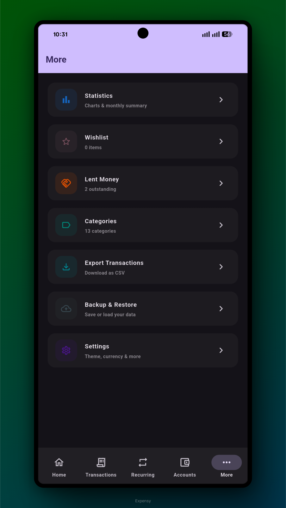
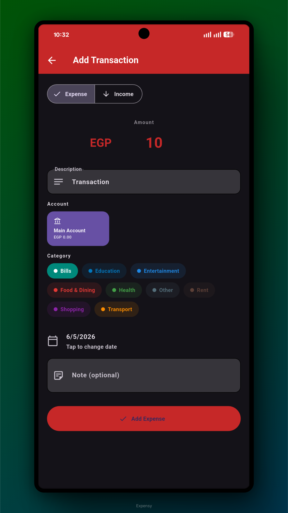
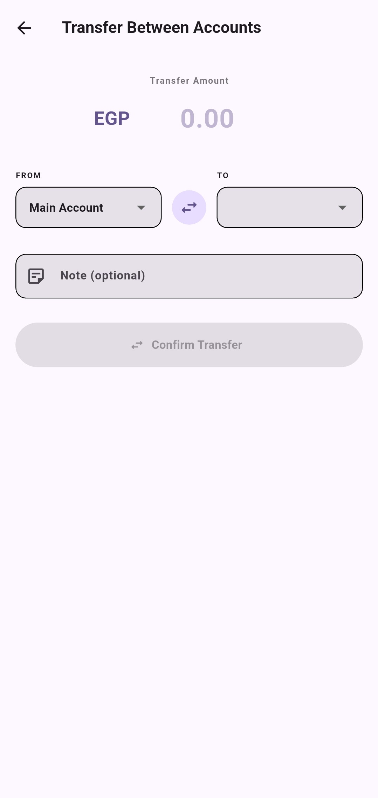
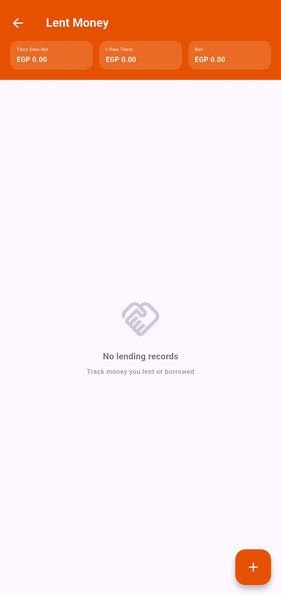
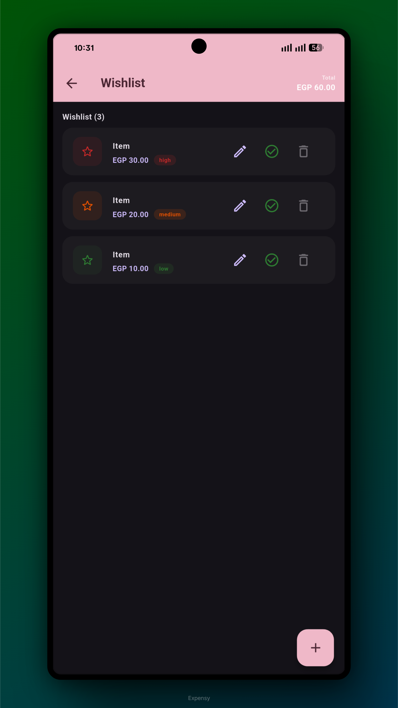
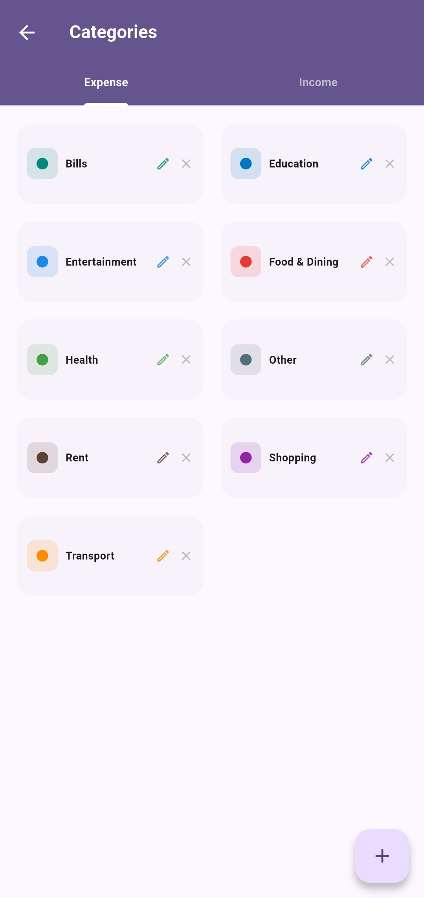
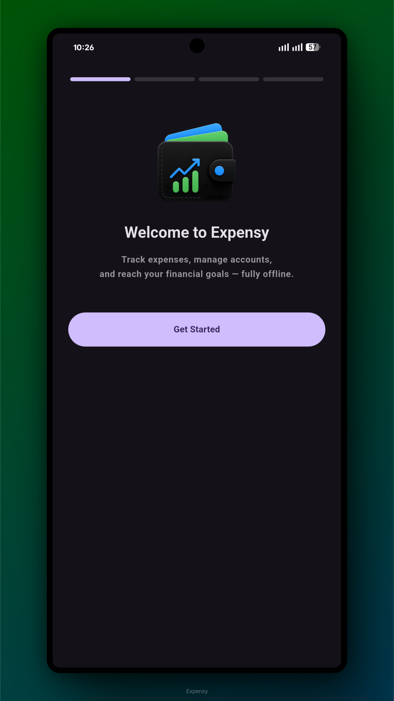

<div align="center">


# Expensy

### Your personal, fully offline finance tracker

[](https://flutter.dev)
[](https://dart.dev)
[](https://android.com)
[](https://github.com/yourusername/expensy/releases)
[](LICENSE)

**Expensy** is a clean, fast, and fully offline expense manager built with Flutter.  
No accounts. No cloud. No ads. Your data stays on your device — always.

[**Download APK**](#installation) · [**Features**](#features) · [**Screenshots**](#screenshots) · [**Build It**](#building-from-source)

</div>

---

## Why Expensy?

Most finance apps require you to sign up, sync to the cloud, or show ads. Expensy does none of that.  
It stores everything locally using SQLite, works without internet, and respects your privacy completely.

---

## Features

### 💰 Accounts
- Add unlimited accounts: **Bank**, **Cash**, **Savings**, **Credit Card**, **E-Wallet**
- Pick a custom colour for each account
- See balance, total income, total expense, and transaction count per account
- Edit or delete any account
- **Transfer money between accounts** with a live balance preview

### 📝 Transactions
- Add **income** and **expense** transactions
- Assign to any account and category
- Full-text **search** and filter by type or account
- Swipe left on any transaction to **delete** it
- Tap the edit icon to **modify** any transaction
- Transactions are grouped by date (Today, Yesterday, or full date)

### 📊 Statistics
- **6-month bar chart** comparing income vs expense side by side
- **Expense pie chart** showing breakdown by category
- Navigate month by month using the arrows in the header
- Summary cards for Income, Expense, and Net savings

### 🔁 Recurring Payments
- Track **subscriptions**, loan instalments, rent, and any repeating payment
- Set frequency: every X **days / weeks / months / years**
- Set a **start date** and optional **end date** (or leave open-ended)
- When an end date is set, see the **estimated number of payments** and **total cost**
- App bar shows **estimated monthly** and **weekly** cost across all recurring payments
- Actions per payment: **Pay** (records transaction), **Skip** next, **Edit**, **Delete**
- Progress bar shows paid vs remaining payments

### ⭐ Wishlist
- Add items you are saving up for with a **target price** and **priority** (Low / Medium / High)
- Mark items as **purchased**
- Add notes to any wishlist item

### 🤝 Lent Money
- Track money you **lent** to someone or **borrowed** from someone
- Optionally link to an account — the balance is automatically affected
- Set a **due date** and add notes
- Mark records as **settled** (reverses the account balance effect)
- Summary bar shows: They Owe Me / I Owe Them / Net Balance

### 🏷️ Categories
- Default categories for income and expense (fully editable and deletable)
- Add custom categories with a name and colour
- Used across transactions and recurring payments

### 🔄 Account Transfers
- Transfer any amount between your own accounts
- A debit and a credit transaction are automatically recorded
- Live preview shows both account balances before confirming

### 📤 Export & Backup
- **Export transactions** to CSV — opens the system share sheet
- **Full JSON backup** of all data (accounts, transactions, recurring, wishlist, lent, categories, settings)
- **Restore** from any backup file via the file picker
- Compatible with Excel, Google Sheets, and any spreadsheet app

### ⚙️ Settings
- **Dark Mode** toggle
- **15 theme colours**: Violet, Blue, Green, Rose, Amber, Teal, Orange, Indigo, Cyan, Pink, Lime, Deep Purple, Crimson, Midnight, and **Pitch Black**
- **8 currencies**: EGP, USD, EUR, GBP, SAR, AED, JPY, CAD
- **Week starts on** Monday or Sunday
- **Hide Balance** — shows •••••• instead of your total balance
- Edit your **display name**

---

## Screenshots

> 📱 Screenshots shown on a Pixel device running Android 14 dark mode.

| Home | Transactions | Statistics |
|------|-------------|------------|
|  |  |  |

| Accounts | Recurring Payments | Settings |
|----------|-------------------|---------|
|  |  |  |

| Add Transaction | Transfer | Lent Money |
|----------------|---------|-----------|
|  |  |  |

| Wishlist | Categories | Onboarding |
|---------|------------|-----------|
|  |  |  |

---

## Tech Stack

| Layer | Technology |
|-------|-----------|
| **Framework** | [Flutter](https://flutter.dev) 3.3+ |
| **Language** | [Dart](https://dart.dev) 3.3+ |
| **Database** | [sqflite](https://pub.dev/packages/sqflite) — local SQLite |
| **State Management** | [provider](https://pub.dev/packages/provider) |
| **Charts** | [fl_chart](https://pub.dev/packages/fl_chart) 1.2+ |
| **Preferences** | [shared_preferences](https://pub.dev/packages/shared_preferences) |
| **CSV Export** | [csv](https://pub.dev/packages/csv) |
| **File Sharing** | [share_plus](https://pub.dev/packages/share_plus) |
| **File Picker** | [file_picker](https://pub.dev/packages/file_picker) |
| **Date Formatting** | [intl](https://pub.dev/packages/intl) |

**No internet permission.** All data lives in a local SQLite database.

---

## Project Structure

```
lib/
├── main.dart                     # App entry point & Material theme setup
├── models/
│   └── models.dart               # All data models (Account, Transaction, etc.)
├── database/
│   └── db_helper.dart            # SQLite CRUD operations for all 6 tables
├── providers/
│   └── app_provider.dart         # Global state management (ChangeNotifier)
├── theme/
│   └── app_theme.dart            # Material You themes, seeds, currency registry
├── widgets/
│   └── shared_widgets.dart       # Reusable UI components
└── screens/
    ├── onboarding_screen.dart     # 4-step first-launch setup
    ├── main_shell.dart            # Bottom navigation shell
    ├── home_screen.dart           # Dashboard
    ├── transactions_screen.dart   # Transaction history, search, filter
    ├── add_transaction_screen.dart# Add / edit a transaction
    ├── statistics_screen.dart     # Charts and monthly summary
    ├── accounts_screen.dart       # Account list, add/edit/delete
    ├── transfer_screen.dart       # Move money between accounts
    ├── more_screen.dart           # Hub for extra features
    ├── recurring_screen.dart      # Recurring payment management
    ├── wishlist_screen.dart       # Wishlist tracker
    ├── lended_screen.dart         # Lent/borrowed money tracker
    ├── categories_screen.dart     # Category management
    ├── settings_screen.dart       # App settings
    ├── export_screen.dart         # CSV export
    └── backup_screen.dart         # Backup & restore
```

---

## Building from Source

### Prerequisites

Make sure you have the following installed:

| Tool | Version | Download |
|------|---------|---------|
| Flutter SDK | 3.3 or higher | [flutter.dev/docs/get-started/install](https://flutter.dev/docs/get-started/install) |
| Dart SDK | 3.3 or higher | Included with Flutter |
| Android Studio | Latest stable | [developer.android.com/studio](https://developer.android.com/studio) |
| Java JDK | 11 or higher | [adoptium.net](https://adoptium.net/) |

Verify your setup:
```bash
flutter doctor
```
All items should show a green checkmark ✓.

---

### Step 1 — Clone the repository

```bash
git clone https://github.com/yourusername/expensy.git
cd expensy
```

### Step 2 — Install dependencies

```bash
flutter pub get
```

### Step 3 — Run in development

Connect an Android device or start an emulator, then:

```bash
# List available devices
flutter devices

# Run on your device
flutter run
```

### Step 4 — Build a release APK

```bash
# Standard release APK
flutter build apk --release

# Split APKs by CPU architecture (smaller download size — recommended)
flutter build apk --split-per-abi --release

# App Bundle for Google Play Store
flutter build appbundle --release
```

Output locations:
- `build/app/outputs/flutter-apk/app-release.apk`
- `build/app/outputs/flutter-apk/app-arm64-v8a-release.apk` ← most modern Android phones

---

### Install directly via USB

```bash
adb install build/app/outputs/flutter-apk/app-release.apk
```

---

## Installation

### Option A — Build from source (above)

### Option B — Download APK directly

1. Go to the [**Releases**](https://github.com/yourusername/expensy/releases) page
2. Download `app-release.apk` from the latest release
3. On your Android phone:  
   → **Settings → Security → Install Unknown Apps**  
   → Enable for your file manager or browser
4. Open the APK and install

> **Minimum Android version:** 5.0 (API 21)  
> **Tested on:** Android 12, 13, 14

---

## Gradle / Build Configuration

| Component | Version |
|-----------|---------|
| Gradle | 9.5.0 |
| Android Gradle Plugin | 8.7.3 |
| Kotlin | 2.1.0 |
| Java | 11 |
| Min SDK | 21 (Android 5.0) |
| Target SDK | 35 (Android 15) |
| Package | `com.ma.expensy` |

---

## Data & Privacy

- ✅ **Zero internet permission** — not declared in AndroidManifest
- ✅ **No accounts, no sign-up, no sync**
- ✅ **No analytics, no crash reporting, no telemetry**
- ✅ **No ads** of any kind
- ✅ **All data in local SQLite** database on your device
- ✅ **Backup is a plain JSON file** you control completely
- ✅ **Uninstalling the app deletes all data** — nothing is left behind

---


## .gitignore

When you create your GitHub repository, add a `.gitignore` file directly on GitHub  
(*Add file → Create new file → name it `.gitignore`*) with the following content:

```gitignore
# Flutter / Dart
.dart_tool/
.flutter-plugins
.flutter-plugins-dependencies
.packages
.pub-cache/
.pub/
build/
*.iml

# Android
android/.gradle/
android/local.properties
android/key.properties
*.jks
*.keystore

# IDE
.idea/
.vscode/
*.suo
*.log

# macOS
.DS_Store
```

---

## Contributing

Contributions are welcome! Here is how to get started:

1. **Fork** the repository
2. **Create** a feature branch: `git checkout -b feature/my-feature`
3. **Commit** your changes: `git commit -m "Add my feature"`
4. **Push** to the branch: `git push origin feature/my-feature`
5. **Open a Pull Request** describing what you changed and why

Please make sure your code:
- Has no analysis warnings (`flutter analyze`)
- Does not break existing functionality
- Follows the existing code style (no extra blank lines, `withValues(alpha:)` not `withOpacity()`)

---

## License

```
MIT License

Copyright (c) 2026 Mina

Permission is hereby granted, free of charge, to any person obtaining a copy
of this software and associated documentation files (the "Software"), to deal
in the Software without restriction, including without limitation the rights
to use, copy, modify, merge, publish, distribute, sublicense, and/or sell
copies of the Software, and to permit persons to whom the Software is
furnished to do so, subject to the following conditions:

The above copyright notice and this permission notice shall be included in all
copies or substantial portions of the Software.

THE SOFTWARE IS PROVIDED "AS IS", WITHOUT WARRANTY OF ANY KIND, EXPRESS OR
IMPLIED, INCLUDING BUT NOT LIMITED TO THE WARRANTIES OF MERCHANTABILITY,
FITNESS FOR A PARTICULAR PURPOSE AND NONINFRINGEMENT. IN NO EVENT SHALL THE
AUTHORS OR COPYRIGHT HOLDERS BE LIABLE FOR ANY CLAIM, DAMAGES OR OTHER
LIABILITY, WHETHER IN AN ACTION OF CONTRACT, TORT OR OTHERWISE, ARISING FROM,
OUT OF OR IN CONNECTION WITH THE SOFTWARE OR THE USE OR OTHER DEALINGS IN THE
SOFTWARE.
```

---

<div align="center">

Made with ❤️ and Flutter

**[⬆ Back to top](#expensy)**

</div>
