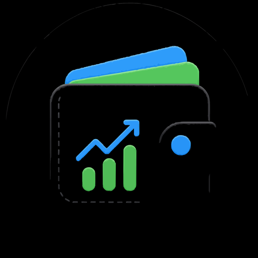
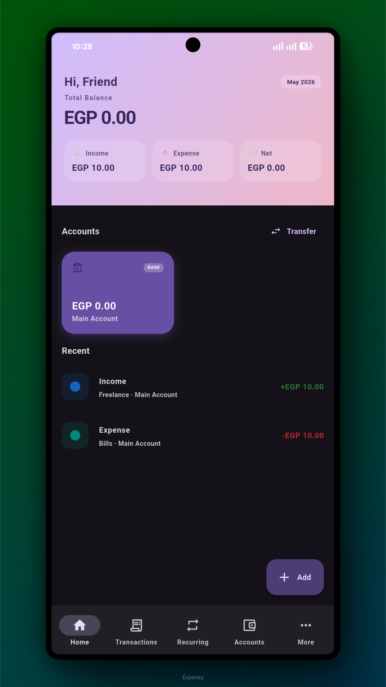
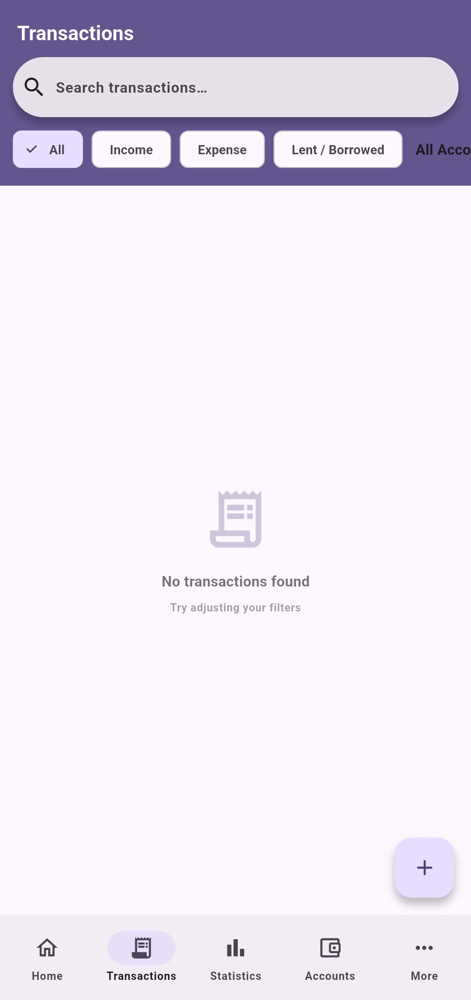
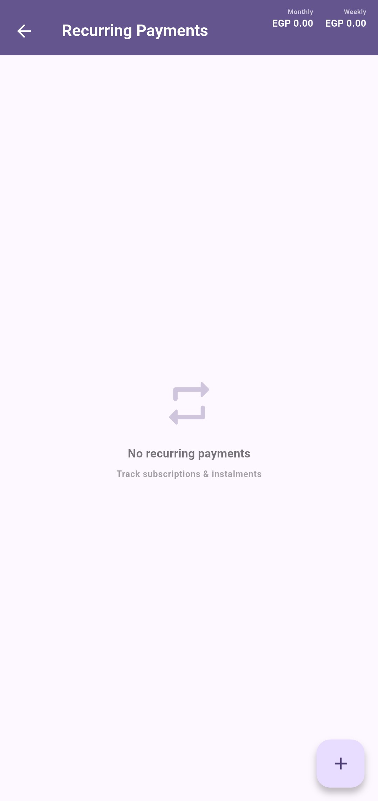
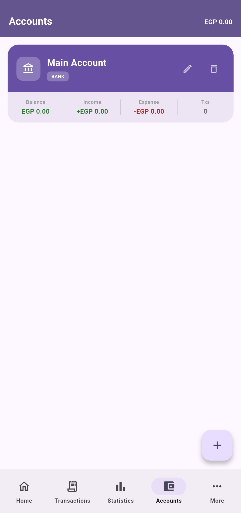
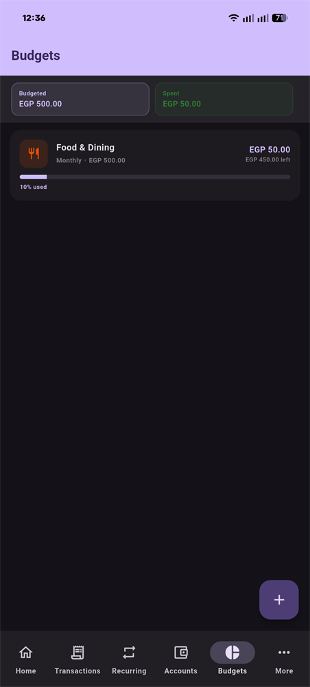
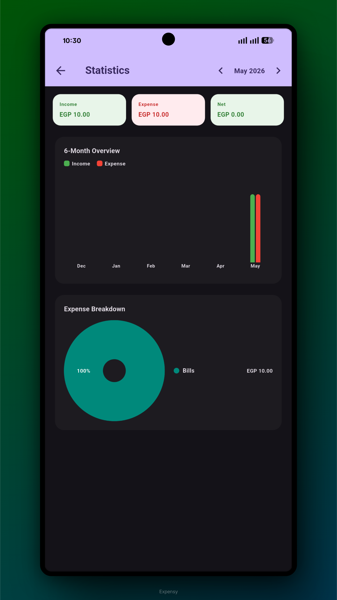

<div align="center">



# Expensy

### Your personal, fully offline finance tracker

[](https://flutter.dev)
[](https://android.com)
[](https://github.com/mina-android/Expensy/releases)
[](LICENSE)

No accounts. No cloud. No ads. Your data stays on your device — always.

[**Download**](#-installation) · [**Features**](#-features) · [**Screenshots**](#-screenshots) · [**Build from Source**](#-build-from-source)

</div>

---

## Why Expensy?

Most finance apps want you to sign up, sync to the cloud, or watch ads. Expensy does none of that — everything lives in a local database on your phone, and the only network calls are a once-a-day exchange rate refresh. Uninstall the app and nothing is left behind.

---

## ✨ Features

- **Accounts** — bank, cash, savings, credit card (with expiration tracking), e-wallet, or gold, each in its own currency, with drag-and-drop custom ordering
- **Linked Accounts** — dynamically link your credit and debit cards to a central bank account to compute a unified total balance
- **Gold accounts** — track holdings by karat and grams, valued automatically from live gold prices
- **Transactions** — income, expense, lent, and borrowed entries in a unified, chronological list view with search, advanced category and amount filters, type pills, swipe-to-delete, bulk-selection mode for mass deletion and categorization, and click-to-edit gestures
- **Transfers** — move money between accounts, with automatic currency conversion
- **Recurring payments** — subscriptions, installments, rent, salary — with reminders and payment history
- **Budgets** — monthly or weekly limits per category, with progress bars and instant push notifications when exceeded
- **Statistics & Insights** — spending charts, trends, and month-over-month comparisons
- **Currency converter** — instant conversion using live exchange rates
- **Savings Goals** — track progress towards savings targets with contributions/withdrawals and completion alerts
- **Assets & Wishlist** — track things you own and things you want to buy
- **Lent & borrowed money** — keep tabs on who owes who, with due-date reminders
- **Daily Reminders** — optional nightly nudge to log your daily spending
- **Backup & Restore** — one JSON file, fully under your control. Also supports importing backups from **GreenStash**!
- **High Performance** — Architected to remain buttery smooth at 120Hz even with thousands of transactions, with snappy, responsive UI animations.

- **Widgets** — a sleek "Nothing Style" quick add widget to instantly launch the add transaction screen, and a new Budget Progress widget to monitor top budgets on your home screen.
- **Custom look** — Material You, 29 accent colours, 10 fonts, AMOLED dark mode

---

## 📸 Screenshots

<div align="center">
  
  
  
  <br>
  
  
  
</div>

---

## 🌍 Localization & Translation

Expensy is being translated into multiple languages using native translation and professional finance terminology for a native feel. Translation is in progress — percentages reflect the share of strings currently translated relative to the English base:

- 🇺🇸 **English** — 100%
- 🇪🇸 **Spanish (Español)** — 100%
- 🇸🇦 **Arabic (العربية)** — 73% (RTL support included)
- 🇫🇷 **French (Français)** — 73%
- 🇩🇪 **German (Deutsch)** — 73%
- 🇮🇳 **Hindi (हिन्दी)** — 73%

Contributions to complete these translations are welcome — see [Contributing](#-contributing).

---

## 📲 Installation

1. Go to [**Releases**](https://github.com/mina-android/Expensy/releases)
2. Download `app-release.apk`
3. On your phone, enable **Install Unknown Apps** for your file manager (Settings → Security)
4. Open the APK and install

> Requires Android 5.0 or newer.

---

## 🛠 Build from Source

**Prerequisites:** [Flutter SDK 3.3+](https://flutter.dev/docs/get-started/install), Java JDK 11+

```bash
git clone https://github.com/mina-android/Expensy.git
cd Expensy
flutter pub get
flutter run

# Signed Release APK (Universal)
flutter build apk --release

# Signed Split-per-ABI APKs (Smaller download size per architecture)
flutter build apk --split-per-abi --release

# Signed Google Play Store App Bundle (.aab)
flutter build appbundle --release
```

Production builds automatically detect `android/key.properties` and sign with `expensy.jks` (`signingConfigs.release`). Output artifacts land in `build/app/outputs/flutter-apk/` (`app-release.apk`, `app-arm64-v8a-release.apk`) and `build/app/outputs/bundle/release/` (`app-release.aab`).

<details>
<summary><strong>Build troubleshooting</strong></summary>

- **`flutter pub get` fails:** run `flutter clean && flutter pub get`
- **Gradle build error:** make sure `gradle-wrapper.properties` points to Gradle **8.11.1**, not 9.x
- **Windows drive-letter errors:** add `kotlin.incremental=false` and `org.gradle.configuration-cache=false` to `android/gradle.properties`
- **Missing SDK licenses:** run `flutter doctor --android-licenses`
- **Notifications not firing:** check Settings → Apps → Expensy → Notifications, and "Alarms & Reminders" on Android 12+

</details>

---

## 🔒 Privacy

- All data stored locally in SQLite — never leaves your device
- Exchange rates fetched from free public APIs, no account or key needed
- No analytics, no crash reporting, no ads
- Backups are plain JSON files that you control
- Uninstalling deletes everything

---


## 🗺 Roadmap

- [ ] iOS support
- [x] Home screen widget
- [ ] Multiple languages (ES 100%, AR/DE/FR/HI at 73%)
- [ ] Recurring payment auto-pay
- [x] Budgets per category
- [x] Push notifications for recurring & lent/borrowed reminders

---

## 🤝 Contributing

1. Fork the repo
2. Create a branch: `git checkout -b feature/my-feature`
3. Commit and push your changes
4. Open a Pull Request

Please run `flutter analyze` before submitting.

---

## License

MIT License — see [LICENSE](LICENSE) for details.
Copyright © 2026 [Mina Android](https://github.com/mina-android)

<div align="center">

Made with ❤️ and Flutter · [**More projects**](https://github.com/mina-android)

</div>


## Recent Updates
- Introduced Linked Accounts and drag-and-drop account reordering.
- Separated Cards from standard Accounts.