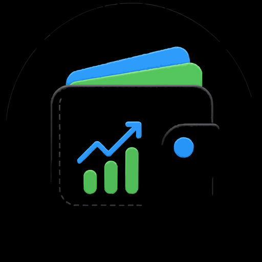
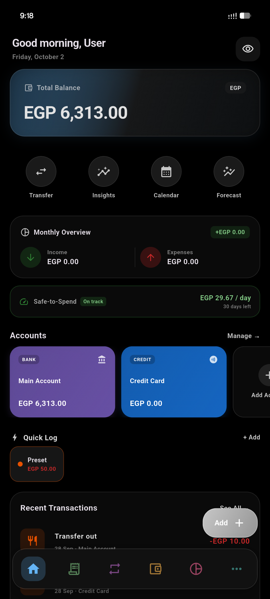
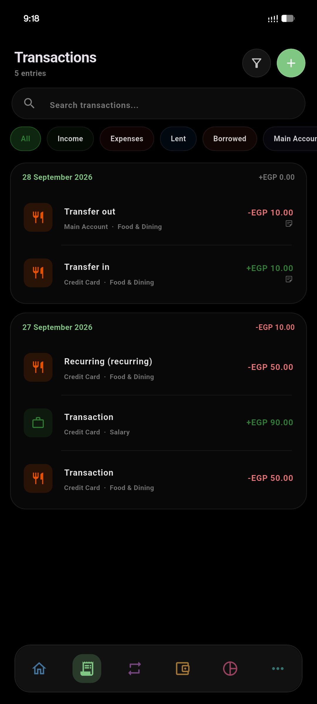
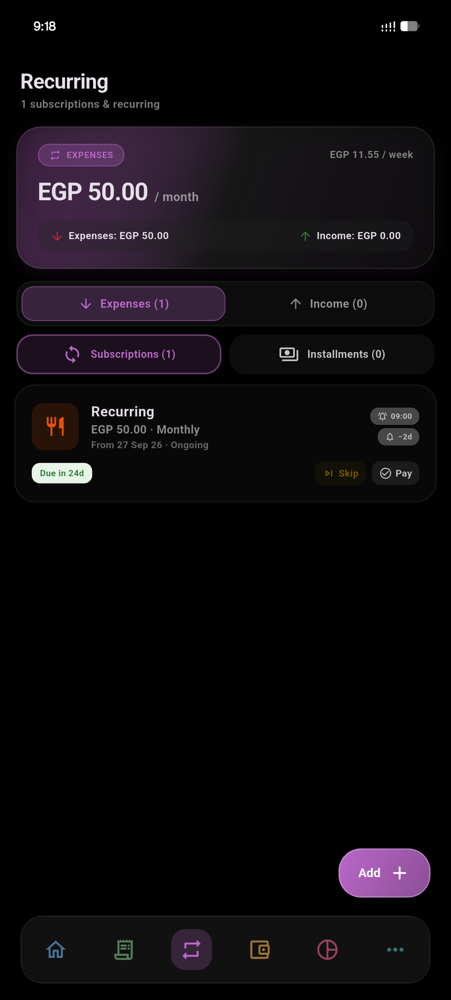
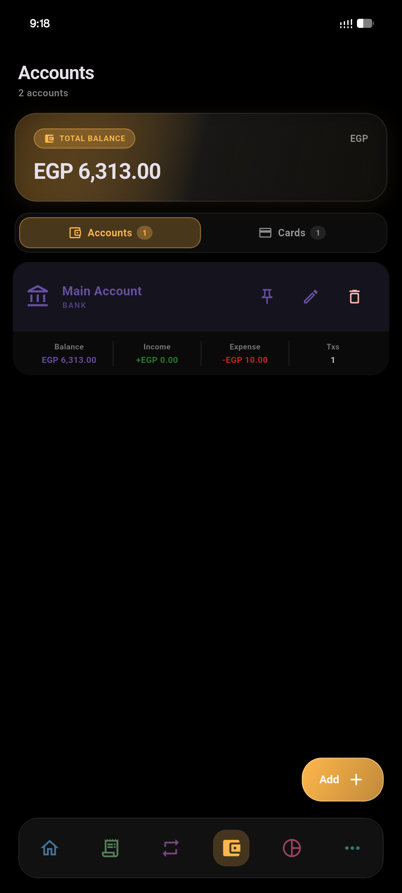
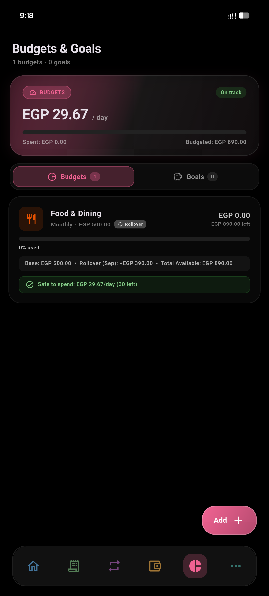
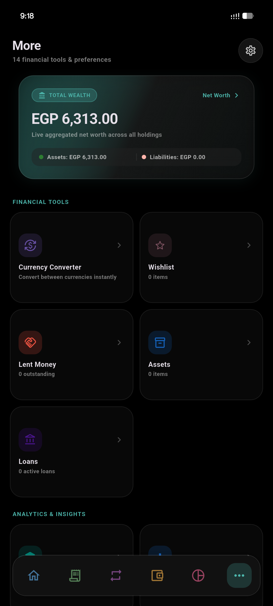
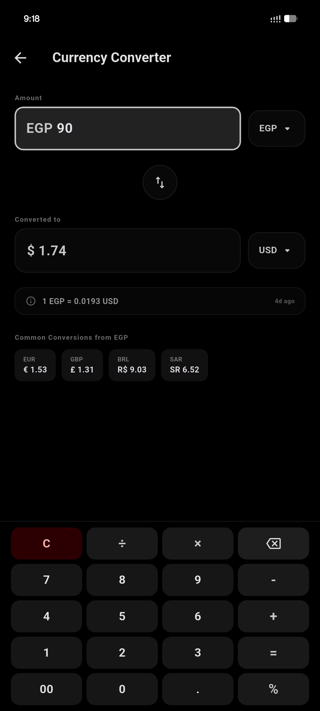
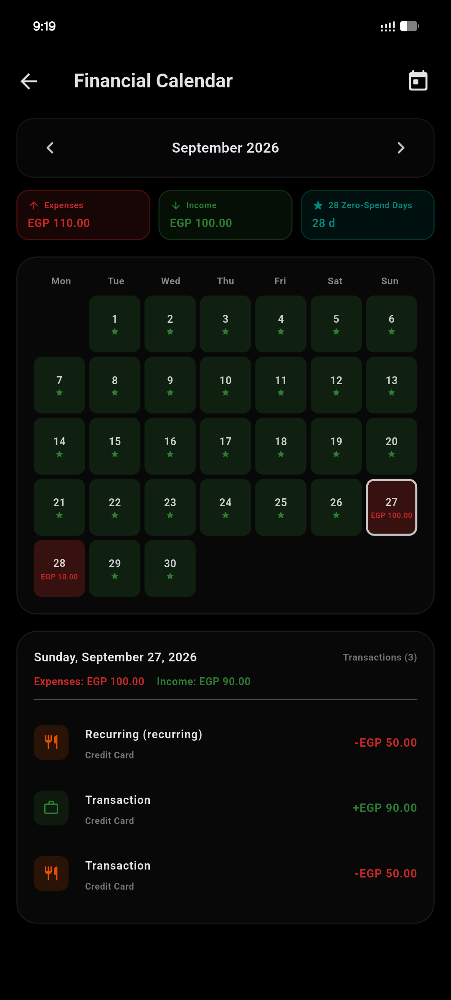
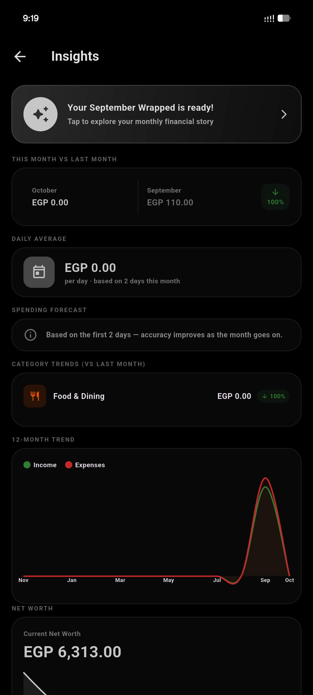

<div align="center">



<h1>Expensy</h1>

<h3>A finance tracker that stays on your phone, not in the cloud</h3>

[](https://android.com) [](https://github.com/mina-android/Expensy/releases) [](LICENSE)

Expensy is a simple app that helps anyone manage their money, track debts, and plan ahead with complete peace of mind.  
It works completely offline, with no sign-ups or ads, and your financial data never leaves your phone.

[**Download**](#-download) · [**Features**](#-what-you-can-do) · [**Screenshots**](#-take-a-look) · [**FAQ**](#-questions-you-might-have) · [**For Developers**](#-for-developers)

</div>

---

## ✨ What you can do

- **💳 Accounts & credit card settlement**: Track bank accounts, cash, digital wallets, credit cards, and gold holdings. Pay your monthly credit card balance in a single tap from a linked bank account.
- **⚡ 1-Tap quick presets & built-in calculator**: Pin your frequent daily expenses right on your home screen for one-tap logging, and calculate taxes or split totals instantly with the tactile in-app keypad.
- **🎯 Rollover budgets & safe-to-spend pacer**: Set category spending targets where unused funds roll over into next month, and see at a glance how much you can comfortably spend each day.
- **🔄 Subscriptions, bills & auto-pay**: Keep tabs on recurring bills, installment plans, and salaries, complete with custom auto-pay times and scheduled reminder notifications.
- **📈 Wealth management & net worth**: Get a clear picture of what you own versus what you owe, with automatic daily net worth snapshots, asset tracking, and interactive growth charts.
- **🔔 Gentle reminders**: Get a nudge when a recurring bill is due, when an installment is approaching, or when someone's repayment date arrives so nothing slips through the cracks.
- **📤 Share your data**: Turn what you've logged into a clean, multi-page vector PDF statement or a spreadsheet in a couple of taps, rendered 100% offline.
- **💾 Backups that just work**: Switching phones? Save an unencrypted or encrypted JSON backup file directly to your device storage and restore everything in seconds.
- **🎨 Easy on the eyes**: Built with modern Material You dynamic theming, 29 vibrant accent colors, a true AMOLED pure-black mode, and edge-to-edge status bar styling.

---

## 🧭 Getting started

1. **Set up your profile & currency**: Choose your primary currency, pick your favorite accent color and font, or let Material You match your phone's wallpaper.
2. **Add your primary accounts**: Add your cash wallet, bank accounts, or credit cards to see your starting total balance.
3. **Log your first transaction or pin a preset**: Tap the center action button to log an expense, or pin daily expenses like morning coffee to your home screen for 1-tap entry.
4. **Plan ahead & export reports**: Set category budgets, schedule your recurring monthly bills, or generate a tidy PDF report whenever you like.

---

## 📸 Take a look

<p align="center">
  
  
  
</p>

<p align="center">
  
  
  
</p>

<p align="center">
  
  
  
</p>

---

## 📲 Download

1. Head over to the [**Releases page**](https://github.com/mina-android/Expensy/releases)
2. Grab the latest APK. If you're not sure which one, pick the file ending in `arm64-v8a`, since most newer phones use that
3. Open it, and if Android asks, allow installs from unknown sources

It runs on Android 5.0 (Lollipop) or newer and takes up about 27 MB.

---

## 🔒 Your privacy

I take this seriously, so here's the plain version:

- **Everything stays on your phone**: All your records are stored locally using a high-performance SQLite database via Drift over Dart FFI in a background isolate.
- **No accounts, no ads, and no tracking**: No sign-up screens, no telemetry, no analytics SDKs, and zero cloud databases pinging external servers.
- **If you uninstall the app, your data goes with it**: Because nothing is stored remotely, make sure to save a backup to your storage or drive before changing phones or uninstalling.

---

## ❓ Questions you might have

**Do I need an internet connection to use it?**  
No. Expensy works entirely offline. The only optional network requests are to fetch live currency conversion rates and spot gold prices when you choose to refresh them.

**What happens to my data if I get a new phone?**  
Go to More → Backup & Restore, tap "Create Backup", and save the JSON backup file to your Google Drive or send it to your new phone. Once you install Expensy on your new device, tap "Restore Backup".

**Can I import data from other finance apps?**  
Yes! Expensy includes built-in support for importing backups from GreenStash and restoring previous Expensy JSON backups.

**Is there an iPhone version?**  
Not right now. Expensy is tailored specifically for Android with native Material You theming, Quick Settings tiles, home-screen widgets, and app shortcuts.

---

## 💬 Say hello

- Ran into a bug or want a new feature? [Open an issue](https://github.com/mina-android/Expensy/issues)
- Just want to chat or give feedback? Reach me via GitHub Issues or discussions
- If the app has made your life a little easier, a ⭐ on the repo would make my day

---

## 🛠 For developers

<details>
<summary><strong>What it's built with</strong></summary>

- **Flutter & Dart**: Cross-platform UI toolkit targeting Android (minSdk 21 / Android 5.0+).
- **Drift & SQLite**: Compile-time type-safe persistence executing in a dedicated background isolate via Dart FFI.
- **Provider**: Streamlined and responsive app-wide state management.
- **Key Packages**: `fl_chart` (financial visualizations), `pdf` & `printing` (offline vector reports), `excel` (spreadsheets), `home_widget` (interactive Android widgets), and `flutter_local_notifications` (offline bill & budget alerts).

</details>

<details>
<summary><strong>Run it yourself</strong></summary>

You'll need Flutter 3.3+ and Android Studio with Java JDK 11+. Then:

```bash
git clone https://github.com/mina-android/Expensy.git
cd Expensy
flutter pub get
flutter run
```

To build release APKs: `flutter build apk --split-per-abi --release`

</details>

<details>
<summary><strong>Want to help out?</strong></summary>

Contributions are welcome! Here's how:

1. Fork the repo
2. Create a branch: `git checkout -b feature/my-new-feature`
3. Make your changes and push them
4. Open a Pull Request and tell me what you changed

Please run `flutter analyze` before opening a pull request to keep code quality and linting clean.

</details>

---

## 📄 License

GNU General Public License v3.0. Have a look at [LICENSE](LICENSE) for the details.  
Copyright © 2026 [Mina Android](https://github.com/mina-android)

<div align="center">

Made with ❤️ for anyone who wants to take control of their finances · [**See my other projects**](https://github.com/mina-android)

</div>
